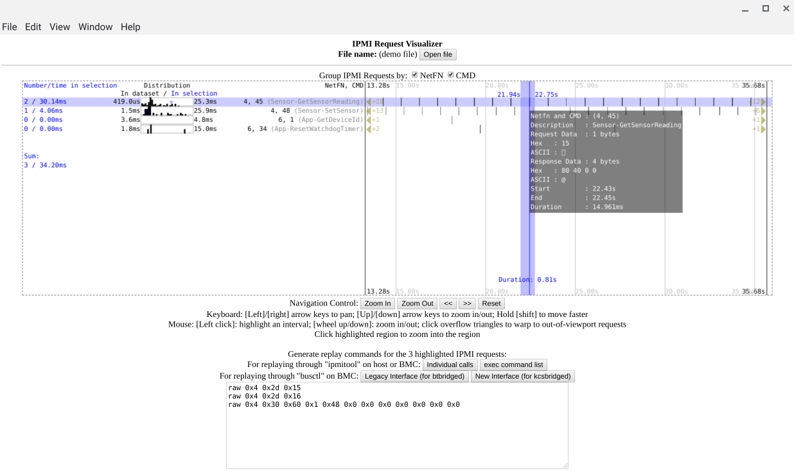

This program visualizes IPMI traffic for OpenBMC-based systems. It allows the user to pan, zoom and highlight the timeframe, as well as inspect the distribution of the time it takes ipmid to process the message, and generate commands to replay those IPMI requests by talking to `ipmid` directly.

1440x900 (WSXGA+) or higher screen resolution (or equivalent logic pixel dimension for HiDPI displays) recommended.

Its inputs are DBus traffic dumps that involve DBus signals and method calls launched against the IPMI daemon (ipmid). To be specific, there are two possible ways:

- For the "legacy" interface:
  - A request is sent to IPMID by a DBus signal "ReceivedMessage". (The "ReceivedMessage" signal name actually means the bridge daemon (`btbridged`) "receives" a message from the "host".)
  - The response is a method call "sendMessage" which means the bridge daemon sends a message response back to the "host".

- For the "new" interface:
  - A request is a DBus method call "execute".
  - The IPMI response is just the method response of this method call.

The input to this program is a text dump of DBus messages that may be obtained by the "dbus-monitor" command.

This program uses Electron to run on a desktop computer (should be compatible with Windows, Linux, Mac and ChromeOS.)
To build and run:

1. `npm install`

2. `npm start`

